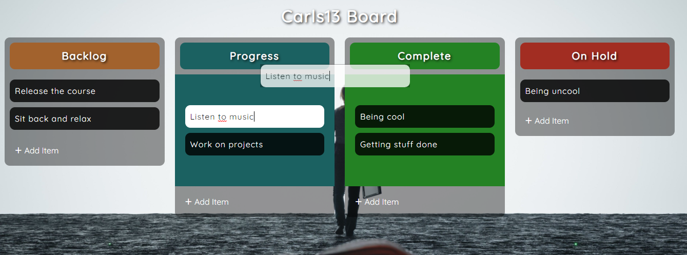
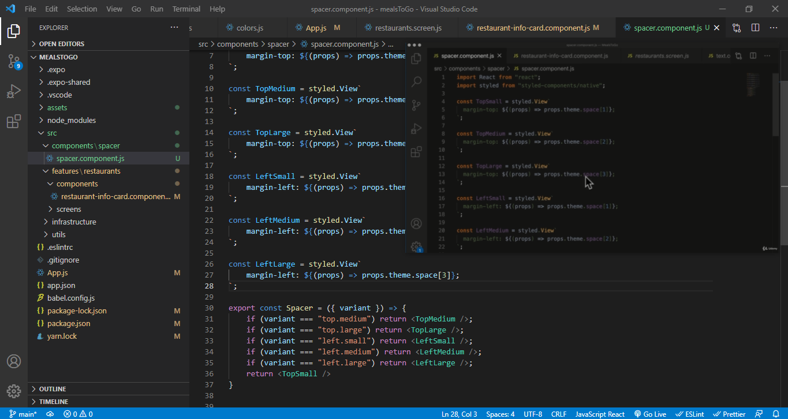

En el 2020, entre tantas cosas, hice un curso de la increíble academia Zero to Mastery en el cual desarrollamos 20 mini proyectos de Javascript. 

Sé que podrá sonar un poco cliché o amateur, pero el mismo me sirvió no solo para reforzar los conocimientos de HTML, CSS y Javascript, sino de conocer un poco más acerca de este lenguaje y de sus diferentes APIs. Funcionalidades nativas tales como reproducción de video, de audio, modo imagen en imagen, dibujo en canvas, drag and drop, entre otras.

No te voy a aburrir hablándote de los 20 proyectos, asi que te comentaré brevemente acerca de los más destacados según mi opinión:

**1. Reproductor de vídeo:**

Todos hemos utilizado diferentes reproductores de vídeos a través de múltiples páginas en la web, unos más cómodos, sencillos y prácticos de utilizar que otros. 

Sabemos que ellos comparten ciertas funcionalidades en común: la capacidad de adelantar o rebobinar, ajustar el volumn, cambiar la velocidad de reproducción, saltar hacia un momento en específico del vídeo, etc. En este proyecto se exploraron y desarrollaron dichos features.

Se empleó la API de reproducción de video de Javascript, de la cual puedes leer [en este enlace.](https://developer.mozilla.org/es/docs/Web/API/HTMLMediaElement) Y el proyecto, puedes verlo [aquí.](https://carls13.github.io/20-javascript-projects/video-player/)

**2. Tablero de tareas:**

¿Has utilizado Trello, Jira o aplicaciones similares? Este tipo de plataformas permiten gestionar las múltiples tareas asignadas en un proyecto, ideal para equipos medianos y grandes. Dichas tareas tienen múltiples status: Asignada, En progreso, A revisar y Completada.

En este proyecto, tratamos de recrear de manera básica este tipo de funcionalidades, asignando un conjunto de tareas en diferentes estados, con la capacidad de poder editar sus nombres y poder guardarlas en Local Storage.

Se utilizó la API nativa de Drag and Drop de Javascript, la cual puedes conocer un poco más [en este enlace.](https://developer.mozilla.org/es/docs/Web/API/HTMLMediaElement). Y [en este otro](https://carls13.github.io/20-javascript-projects/drag-and-drop/) podrás ver el proyecto en funcionamiento.

**3. Picture in picture:**

Te tengo un regalo.

¿No te ha ocurrido que ves un video y necesitas hacer otra actividad paralelamente? Ya sea que estés tomando un curso, estudiando inglés o transcribiendo. Es muy tedioso tener que cambiar de ventana a cada rato para poder hacer ambas cosas al mismo tiempo. Pues te tengo una solución.

Pon tu vídeo en modo imagen en imagen. De esta manera, puedes ponerlo encima de la aplicación que necesites utilizar de manera que sea lo más comodo posible para ti. Mira cómo lo utilizo yo:

Accede al proyecto [en este enlace](https://carls13.github.io/20-javascript-projects/picture-in-picture/). Navegadores como Brave ya implementan esta función de manera nativa, pero si no deseas cambiar de browser bien puedes ir a dicho link😁

¡Úsalo de manera responsable! Nada de ver películas en la hora de trabajo.

Estos fueron los proyectos principales. Si quieres acceder al código de todos los proyectos, puedes verlo [en este enlace](https://github.com/Carls13/20-javascript-projects). También te dejaré la lista con los enlaces de lso proyectos para que los puedas ver en vivo:

**[1. Navegación animada](https://carls13.github.io/20-javascript-projects/animated-navigation/)**

**[2. Plantilla animada](https://carls13.github.io/20-javascript-projects/animated-template/)**

**[3. Favoritos](https://carls13.github.io/20-javascript-projects/bookmark/)**

**[4. Calculadora](https://carls13.github.io/20-javascript-projects/calculator/)**

**[5. Cuenta regresiva personalizada](https://carls13.github.io/20-javascript-projects/custom-countdown/)**

**[6. Arrastrar y soltar](https://carls13.github.io/20-javascript-projects/drag-and-drop/)**

**[7. Validación de formularios](https://carls13.github.io/20-javascript-projects/form-validation/)**

**[8. Scroll infinito](https://carls13.github.io/20-javascript-projects/infinite-scroll/)**

**[9. Cuentachistes](https://carls13.github.io/20-javascript-projects/joke-teller/)**

**[10. Modo oscuro](https://carls13.github.io/20-javascript-projects/light-dark-mode/)**

**[11. Math Sprint (juego)](https://carls13.github.io/20-javascript-projects/math-sprint/)**

**[12. Reproductor de música](https://carls13.github.io/20-javascript-projects/music-player/)**

**[13. Imágenes de la NASA](https://carls13.github.io/20-javascript-projects/nasa-api-pictures/)**

**[14. Imagen en imagen](https://carls13.github.io/20-javascript-projects/picture-in-picture/)**

**[15. Clon de Paint](https://carls13.github.io/20-javascript-projects/paint-clone/)**

**[16. Pong](https://carls13.github.io/20-javascript-projects/pong/)**

**[17. Generador de citas](https://carls13.github.io/20-javascript-projects/quote-generator/)**

**[18. Splash page](https://carls13.github.io/20-javascript-projects/splash-page/)**

**[19. Spock Rock Lizard Papers Scissors](https://carls13.github.io/20-javascript-projects/spock-rock-game/)**

**[20. Reproductor de video](https://carls13.github.io/20-javascript-projects/video-player/)**

Espero que te gusten. Nos vemos en la próxima👋